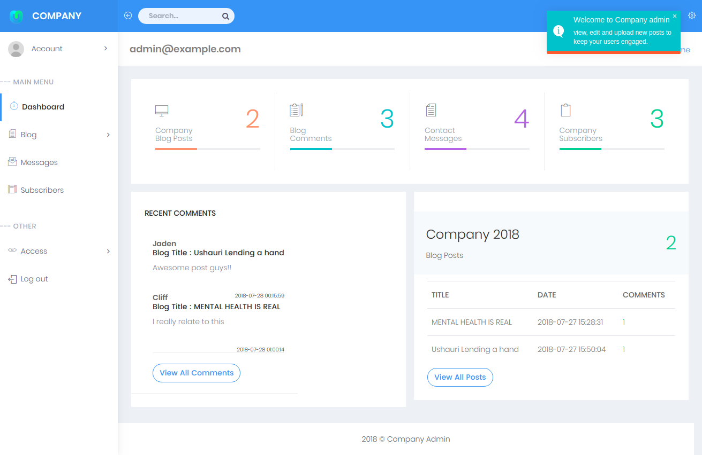

<b>Notice - No Longer Maintained</b> 
<i>Please note that this repository is no longer actively maintained or supported.
Feel free to clone and use the code, but be aware that no updates, bug fixes, or new features will be added.
If you have any questions or want to continue developing this project, you're welcome to fork the repo and build upon it. </i>

---

### NATIVE PHP BLOG WITH ADMIN AND SQL DATABASE

This is a fully functional php application with a website (containing a blog section)
and an Admin dashboard that monitors the blog posts, comments, messages from the contact page and newsletter subscribers...etc

###### _Admin Dashboard_

##### GETTING STARTED

- Download or Clone the project.
- Create a database named "Company" or a name of your choice and import the *SQL* file { Company.sql }
- Set your database credentials in db.php
- Run the project in your local server
- Go to http://localhost/directory/admin/ to LogIn
- Use the testing credentials to login 

{
	
	email : admin@example.com
	password : 123

}

>> Happy Coding :neckbeard:
